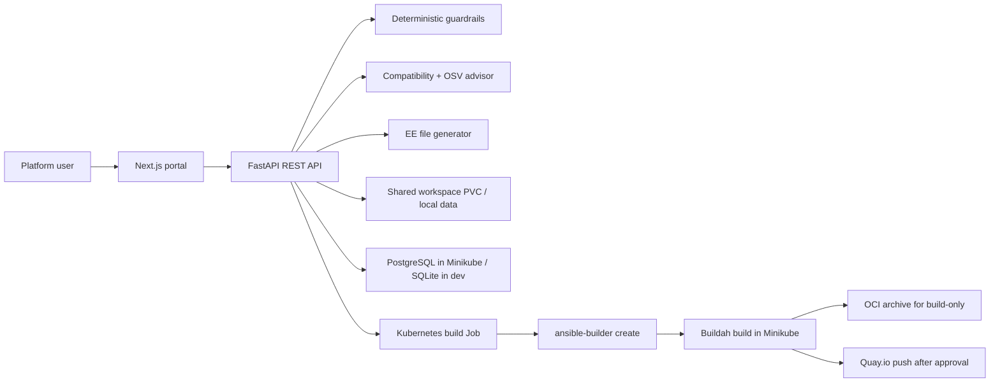

# ee-factory-lab

`ee-factory-lab` is a portfolio-grade local Internal Developer Platform lab for creating small, purpose-driven Ansible Execution Environment images.

The project demonstrates how a platform team could expose one governed self-service capability:

> Create a specialized Ansible Execution Environment image.

The primary runtime is Kubernetes on Minikube. Docker Compose and local scripts exist only as development conveniences.

## Problem

Many teams still create Ansible Execution Environments by hand: copying old definitions, mixing unrelated collections, building locally, and pushing images without a clear approval trail. That works once, then becomes hard to audit, hard to reproduce, and risky to maintain.

This lab turns that manual workflow into an IDP-style product flow:

1. Request a purpose-driven EE.
2. Validate deterministic guardrails.
3. Generate `execution-environment.yml` and dependency files.
4. Review compatibility and vulnerability reports.
5. Approve generated files.
6. Create a Kubernetes build job.
7. Build image artifacts.
8. Approve publication.
9. Push to Quay.io when credentials are provided.
10. Keep request, logs, metadata, docs, and tags traceable.

## What Is An Execution Environment?

An Ansible Execution Environment packages `ansible-core`, `ansible-runner`, Ansible collections, Python dependencies, system dependencies, and a base image into a repeatable container image.

This project uses Ansible Builder schema version 3 and RPM-based base images by default because system dependency handling is aligned with RPM package managers.

Allowed default base images are managed in `config/allowed-base-images.yml` and include Rocky Linux 9, CentOS Stream 9, Fedora stable tags, and UBI 9 tags. Debian, Ubuntu, and Alpine are not offered as generated defaults.

## Design Principle

Execution Environments should be:

- Small.
- Purpose-driven.
- Versioned.
- Owned by a declared automation domain.
- Built from pinned collection versions.

The platform supports multiple collections in one EE, but it warns or blocks disconnected domain mixing. A Windows, VMware, Kubernetes, ServiceNow, cloud, and network mega-image is intentionally treated as a smell.

Official examples:

- `ee-community-general`
- `ee-ansible-windows`
- `ee-community-vmware`
- `ee-servicenow`

Custom names and domains are supported so the platform remains an IDP capability, not a fixed tutorial.

## Architecture



The API never constructs arbitrary shell commands from user input. User input becomes validated models, generated files, and a Kubernetes Job spec. The builder worker then runs controlled command lists.

## Repository Layout

```text
apps/api       FastAPI backend, guardrails, generators, advisors, persistence
apps/portal    Next.js portal
apps/builder   Kubernetes builder worker
config         domain taxonomy, base image policy, guardrails
deploy         Minikube manifests and Helm skeleton
examples       supported sample EE requests
scripts        Windows and Linux lab helper scripts
docs           architecture, security, publishing, enterprise adaptation
```

## Install Lab Tools On Windows

Run from the repository root:

```powershell
Set-ExecutionPolicy -Scope Process Bypass -Force
.\scripts\install-lab.ps1
```

The installer uses `winget` to install or verify Git, Python, Node.js, Make, Podman, kubectl, Minikube, Helm, and Ollama. It sets `RemoteSigned` for the current user and updates the user `PATH`.

Docker Desktop is not installed by the lab bootstrap. Podman is the default local container runtime.

Verify:

```powershell
.\scripts\verify-lab.ps1
```

No registry credentials are requested or stored by the installer.

## Run Development Mode

Backend:

```powershell
cd apps/api
python -m venv .venv
.\.venv\Scripts\Activate.ps1
pip install -r requirements.txt
uvicorn app.main:app --reload --host 127.0.0.1 --port 8000
```

Portal:

```powershell
cd apps/portal
npm install
npm run dev
```

Open:

- Portal: http://localhost:3000
- API health: http://127.0.0.1:8000/health
- OpenAPI docs: http://127.0.0.1:8000/docs

## Run With Minikube

Minikube is the main documented runtime:

```powershell
.\scripts\setup-minikube.ps1
.\scripts\deploy-minikube.ps1
.\scripts\port-forward.ps1 -StopExisting
```

The deployment includes frontend, backend, PostgreSQL, a shared data PVC, configmaps, secret templates, service account, RBAC, services, and a builder Job template.

For the local Minikube lab, the builder Job uses rootful privileged Buildah without mounting the host Docker socket. This is a lab-friendly build path, not the recommended enterprise pattern. Enterprise adaptations should move builds to Tekton, OpenShift Builds, a hardened BuildKit service, Kaniko, or another controlled build service with image scanning and signing.

See `docs/minikube-installation.md`.

## Portal Flow

The portal is organized around the request lifecycle:

- `Dashboard`: current request context, recommended next action, and platform posture.
- `Request`: EE request form with domain, base image, pinned collections, Python dependencies, system dependencies, tag, registry namespace, and publishing mode.
- `Review`: guardrails, compatibility findings, OSV findings, generated files, and generated documentation before build approval.
- `Build & Publish`: Kubernetes build job actions, logs, build metadata, image reference copy, and Quay.io publish approval.
- `History`: traceable request and image version history.
- `Settings`: lab runtime posture, registry target, Minikube builder notes, and Ollama status.

Start with a narrow EE request, validate it, generate files, approve the generated output, build it through the Kubernetes job, then approve publication only when the image metadata and logs look right.

## Validation And Guardrails

Implemented deterministic guardrails include:

- Safe EE naming.
- Valid image tag syntax.
- Pinned collection versions by default.
- Allowed RPM-based base image list.
- Custom base image warning with justification.
- Declared automation domain.
- Collection-to-domain taxonomy mapping.
- Suspicious disconnected domain mixing.
- Python requirement syntax validation.
- System dependency allowlist warnings.
- Secret-like dependency rejection.
- Justification required for risky overrides.
- Fedora base-image bootstrap for `ansible-core >= 2.16` when the public Fedora base image does not include `/usr/bin/python3` by default.

Blocking findings prevent generation.

## Compatibility Advisor

The Collection Compatibility Advisor is intentionally honest: it does not claim to solve every dependency conflict.

It does:

- Map collections to declared automation domains.
- Detect disconnected domains.
- Warn on excessive EE scope.
- Suggest splitting monolithic requests.
- Try best-effort `ansible-galaxy collection download` when `ansible-galaxy` is available.
- Inspect downloaded collection archives for `requirements.txt` and `bindep.txt`.
- Detect exact Python version conflicts when reasonably identifiable.
- Produce Markdown and JSON reports.

## Vulnerability Advisor

The platform includes an optional public vulnerability check using OSV.dev:

- Queries PyPI packages through `POST /v1/querybatch`.
- Looks up returned vulnerability IDs through `GET /v1/vulns/{id}`.
- Scans `ansible-core`, `ansible-runner`, and exact-pinned Python dependencies.
- Produces `vulnerability-report.md` and `vulnerability-report.json`.
- Can warn or block depending on `VULNERABILITY_SCAN_REQUIRED`.

This is not a replacement for enterprise image scanning. It is a useful public API check in the request workflow.

## Build And Publish

The preferred platform flow is Kubernetes Job based:

1. API validates and generates files.
2. User approves generated files.
3. API creates a Kubernetes build Job.
4. Builder runs `ansible-builder create`.
5. Builder builds with BuildKit daemonless when available.
6. Build-only mode writes an OCI archive.
7. Publish mode pushes to Quay.io only after approval.
8. Logs and image metadata are written back to the request workspace.

Docker socket mounting is not required by the Kubernetes path. The local PowerShell script defaults to Podman as a lab convenience and is documented as separate from the enterprise pattern.

Local context test:

```powershell
.\scripts\test-build-image.ps1 -RequestId <request-id>
```

Local image build convenience:

```powershell
.\scripts\test-build-image.ps1 -RequestId <request-id> -BuildImage -Runtime podman -StartPodmanMachine
```

For Red Hat AAP Configuration as Code, public Galaxy and certified Automation Hub content do not expose the same dependency graph. The public lab can build older public `infra.aap_configuration` releases, while current certified collection sets should be wired to private Automation Hub credentials in an enterprise adaptation.

## Versioning Model

Every meaningful IDP edit or Git-driven change should become a new immutable image tag.

The portal supports creating a new version request from an existing request. It copies the previous request, records the parent request ID and change summary, requires a new tag, and sends the new request back through validation, generation, approval, build, and optional Quay publish.

GitHub Actions also support manually building an example EE with a selected tag.

## Quay.io

Quay.io is the primary registry target. Credentials are never committed.

Create the Kubernetes registry secret with:

```bash
read -rp "Quay username or robot: " QUAY_USERNAME
read -rsp "Quay token: " QUAY_PASSWORD
echo
export QUAY_USERNAME QUAY_PASSWORD
./scripts/create-quay-secret.sh
```

PowerShell alternative:

```powershell
.\scripts\create-quay-secret.ps1
```

The secret is created as `kubernetes.io/dockerconfigjson` and mounted into the builder job as `DOCKER_CONFIG/config.json`.

See `docs/quay-publishing.md`.

## Ollama

Ollama is optional. It can assist with user-facing documentation, summaries, split recommendations, and PR text.

It cannot approve requests, override guardrails, or make security decisions.

Configuration:

```env
OLLAMA_ENABLED=false
OLLAMA_BASE_URL=http://host.docker.internal:11434
OLLAMA_MODEL=llama3.1
```

## GitHub Actions

Included workflows:

- `lint-and-test.yml`: backend lint/tests, frontend lint/build, npm audit, basic secret checks.
- `validate-examples.yml`: validates examples, runs OSV dry-run scan, runs `ansible-builder create`.
- `build-example-ee.yml`: manual build with `push=false` by default; `push=true` requires Quay secrets.
- `release.yml`: packages project artifacts.

## Useful Commands

```powershell
make dev-up
make dev-down
make dev-logs
make test
make lint
make validate-examples
make build-example EE=ee-ansible-windows
make generate-docs
```

## References

- Ansible Builder definition v3: https://docs.ansible.com/projects/builder/en/3.0.1/definition/
- OSV API: https://google.github.io/osv.dev/api/
- OSV querybatch: https://google.github.io/osv.dev/post-v1-querybatch/
- BuildKit: https://github.com/moby/buildkit
- Kubernetes docker registry secrets: https://kubernetes.io/docs/tasks/configure-pod-container/pull-image-private-registry/
