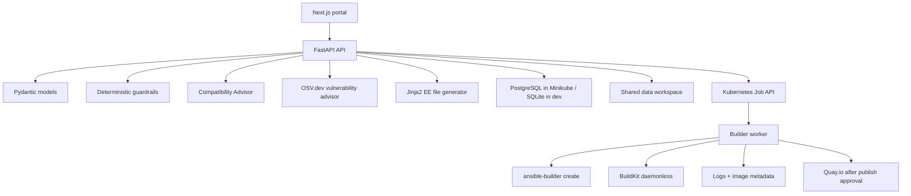

# Architecture

`ee-factory-lab` models an Internal Developer Platform capability for Ansible Execution Environment creation.



## Runtime Boundaries

- Minikube is the primary runtime.
- PostgreSQL is the main Minikube database.
- SQLite is acceptable only for local development.
- Docker Compose is a development convenience, not the primary deployment path.
- The API validates and creates build requests; it does not run arbitrary user shell commands.
- The builder worker runs fixed command lists against generated files.

## Storage

Each request gets:

```text
data/builds/<request-id>/
  request.json
  manifest.json
  execution-environment.yml
  requirements.yml
  requirements.txt
  bindep.txt
  compatibility-report.json
  compatibility-report.md
  vulnerability-report.json
  vulnerability-report.md
  generated-readme.md
  context/
  logs/
```

Metadata is mirrored to the database and JSON files so the lab remains easy to inspect.

## Build Strategy

The Kubernetes path uses a builder Job with a shared PVC. The worker runs `ansible-builder create`, then uses BuildKit daemonless to build an OCI archive or push an image. Buildah is available as a fallback inside the builder image.

The local PowerShell script can build with Docker or Podman for convenience. That path is explicitly lab-only.
