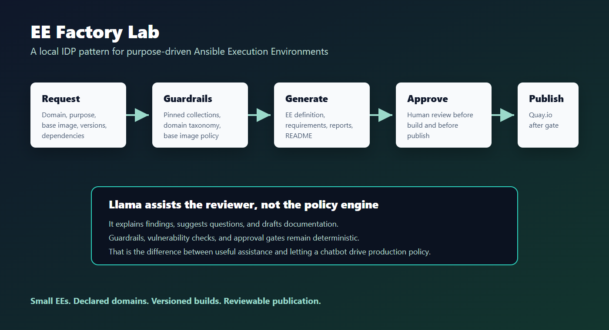
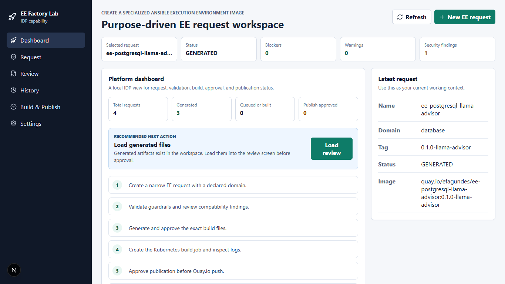
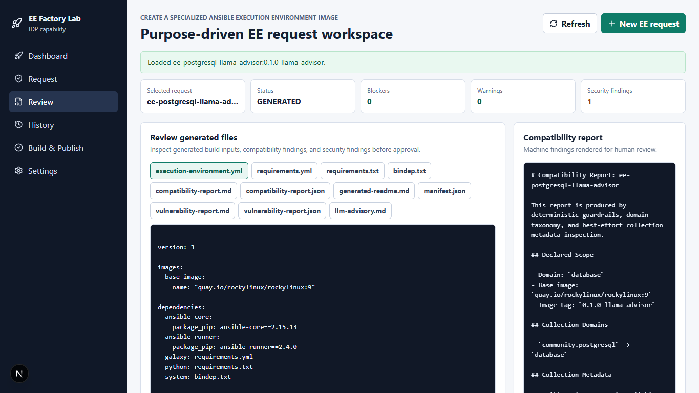
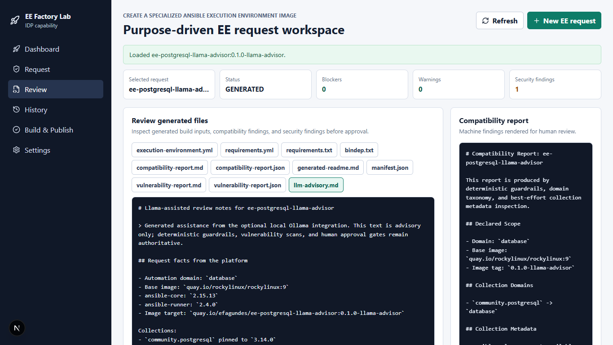
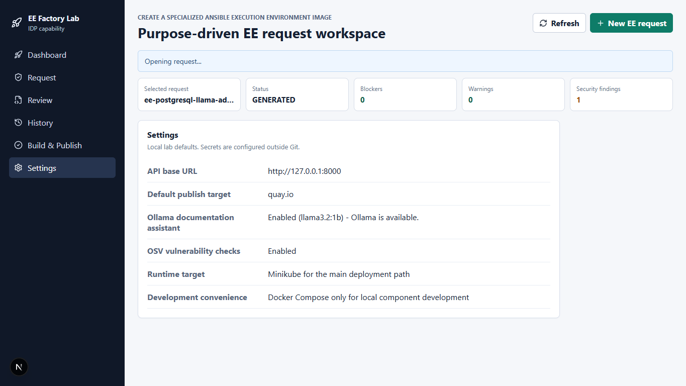

# De build manual de Execution Environment para uma pequena plataforma interna

Tem um tipo de automação que quase todo mundo que trabalha com Ansible já viu em algum momento: alguém precisa de uma Execution Environment, abre uma demanda, junta collection, dependência Python, pacote de sistema, escolhe uma imagem base, roda um build local e, se tudo passa, empurra a imagem para algum registry.

Funciona? Funciona.

Mas também vira aquela esteira feita no susto: copia um `execution-environment.yml` antigo, troca duas linhas, roda build, corrige erro de dependência, roda de novo, e pá pá pá. No começo parece rápido. Depois de alguns times, alguns domínios de automação e algumas imagens com escopos misturados, começa a ficar difícil responder perguntas simples:

- Por que essa collection está nessa imagem?
- Quem aprovou esse build?
- Esse pacote Python está fixado?
- A imagem base é adequada para `ansible-builder`?
- Esse EE é de Windows, VMware, Kubernetes ou tudo ao mesmo tempo?
- Se eu mudar uma dependência, isso vira uma nova tag?
- Onde está o log do build?
- Quem aprovou o push para o Quay?

Foi pensando nesse problema que montei o **EE Factory Lab**: um laboratório local, em Kubernetes com Minikube, que trata criação de Ansible Execution Environment como uma capacidade de plataforma interna.

Não é um script para “buildar EE”. A proposta é simular um produto de plataforma:

> “Crie uma Execution Environment especializada, pequena, versionada e alinhada a um domínio de automação.”

## A ideia central

Uma EE não deveria virar uma mala onde tudo cabe.

Ela deveria parecer mais com um kit de trabalho por contexto: se o time vai automatizar PostgreSQL, a imagem precisa carregar PostgreSQL. Se o time vai automatizar Windows, outra imagem. Se é VMware, outra. Quando misturamos Windows, VMware, Kubernetes, ServiceNow e cloud numa imagem só, a gente até ganha conveniência no primeiro dia, mas compra conflito de dependência, build pesado e manutenção ruim para os meses seguintes.

Então o fluxo do lab força algumas perguntas antes do build:

- Qual é o domínio de automação?
- As collections estão com versão fixada?
- A imagem base é RPM-based e compatível com `ansible-builder`?
- As dependências Python parecem seguras?
- Os pacotes de sistema fazem sentido?
- Existe mistura suspeita de domínios?
- O usuário aprovou os arquivos gerados antes do build?
- O usuário aprovou a publicação antes do push para o Quay?

## Onde entra o Llama

Eu habilitei integração local com Ollama/Llama, mas com uma regra importante: **LLM não decide política**.

O Llama não aprova build.
Não ignora guardrail.
Não libera vulnerabilidade.
Não decide se uma imagem pode ir para produção.

Ele ajuda em outro lugar: comunicação.

Ele gera notas de revisão em linguagem humana, explica os achados, sugere perguntas para o requester e ajuda a transformar um relatório técnico em algo que um time consegue discutir sem ficar decifrando só JSON e logs.

Essa separação é importante. Em plataforma, LLM pode ser um bom copiloto de contexto, mas não pode virar o freio do carro. O freio precisa ser determinístico: guardrails, políticas, aprovação humana, scanner, assinatura, auditoria.

No projeto, o advisory do Llama sempre vem marcado como assistência gerada. Além disso, o texto mostra antes os fatos determinísticos do sistema: domínio, imagem base, versões, collections, dependências e findings. Se a narrativa do modelo escorregar, os fatos da plataforma continuam sendo a fonte de verdade.

## O que o lab entrega

O fluxo principal é:

1. Usuário cria um request de EE no portal.
2. A API valida nome, tag, domínio, imagem base e versions.
3. Guardrails bloqueiam ou avisam.
4. O Compatibility Advisor avalia escopo e dependências.
5. OSV.dev consulta vulnerabilidades públicas de pacotes Python.
6. O sistema gera `execution-environment.yml`, `requirements.yml`, `requirements.txt`, `bindep.txt`, manifest, relatórios e README.
7. O usuário aprova os arquivos gerados.
8. A API cria um Kubernetes Job.
9. O builder roda `ansible-builder create`.
10. A imagem é construída com Buildah no Minikube.
11. O usuário aprova a publicação.
12. A imagem é enviada para Quay.io.

Tudo isso com logs, metadata, status de aprovação e tag de imagem.

## O achado mais interessante

Durante os testes apareceu um problema real: algumas combinações de imagem base e versão de `ansible-core` quebram por causa da versão de Python disponível.

Exemplo: Rocky/CentOS 9 com Python 3.9 não combina com `ansible-core >= 2.16` nesse lab. Isso virou guardrail.

Também apareceu outro detalhe bem prático: `ansible-builder` em ambiente Windows pode gerar `COPY _build\requirements.txt` no Containerfile. Para builders Linux, isso precisa ser normalizado para `/`. Isso também virou correção de plataforma.

Esse é o tipo de coisa que mostra por que plataforma importa. Não é glamour. É reduzir tropeço repetido.

## Como eu adaptaria para produção

Para produção, eu não levaria o lab “como está” e pronto. Eu usaria como blueprint:

- Trocar SQLite/dev por PostgreSQL gerenciado.
- Integrar SSO e RBAC.
- Amarrar requests a usuários e grupos.
- Colocar política com OPA/Kyverno/Conftest.
- Usar Tekton, OpenShift Builds, BuildKit hardened ou pipeline corporativa.
- Adicionar scanner de imagem, SBOM e assinatura com Cosign.
- Publicar em registry privado ou Quay Enterprise.
- Integrar com Automation Hub privado.
- Registrar imagem aprovada no AAP Controller.
- Guardar trilha de auditoria append-only.
- Abrir mudança automática via GitOps.
- Integrar com ServiceNow quando fizer sentido, sem transformar tudo numa RITM manual.

O ponto não é “ter mais ferramenta”. É tirar o build de EE da cabeça de uma pessoa e colocar em um fluxo governado, repetível e visível.

## Por que isso me interessa

Porque já vi muito build feito na hora. Eu mesmo já fiz bastante. Você precisa entregar, o time está pressionado, alguém pede “só coloca essa collection aqui”, e daqui a pouco a imagem que era para um domínio vira uma bancada cheia de coisa que ninguém sabe mais quem colocou.

O EE Factory Lab é uma forma de transformar esse caos pequeno, que parece inofensivo, em um produto de plataforma.

Não resolve todos os problemas do mundo. Mas cria uma direção boa:

- menos build artesanal;
- menos imagem monolítica;
- mais domínio declarado;
- mais versionamento;
- mais aprovação explícita;
- mais rastreabilidade;
- e LLM ajudando onde ele deve ajudar: explicando contexto, não decidindo política.

Projeto: https://github.com/e-fagundes/ee-factory-lab
